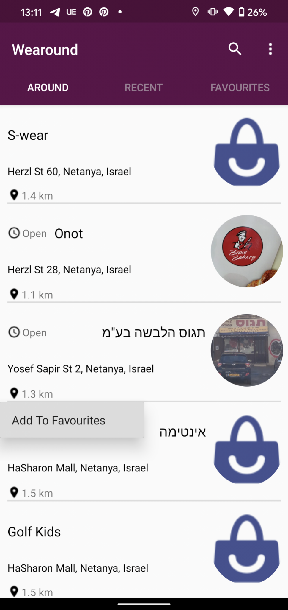

# Wearound

Wearound is a mobile app that finds local clothing stores according to the user's defined distance.

The user can therefore save a store to his favourties and access the location of the app as well as all kinds of data on the store (closing hours, distance etc.).
The data comes from the Google API and the Google Maps API.

## Installation

You can download the APK with this link
https://drive.google.com/uc?id=1qPO0UgiqkeOPNScnOxp9E_g9h1bq3Ms6&export=download

Or scan QR code straight from your Android device

